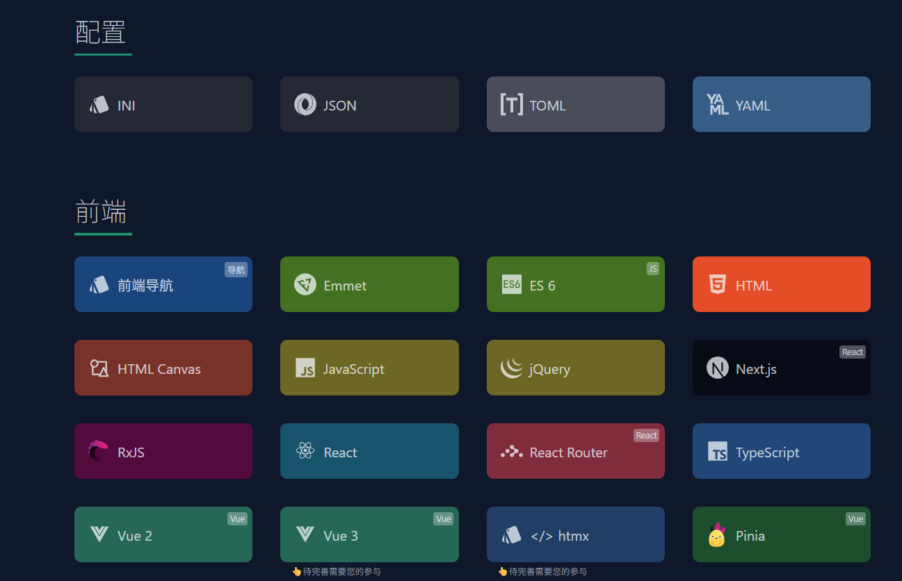

# QR Nest 文档管理系统开发计划

## 1. 技术方案

### 1.1 技术栈

| 类别         | 技术/工具            | 用途                       |
| ------------ | -------------------- | -------------------------- |
| 后端框架     | Nest.js              | 构建API服务和WebSocket服务 |
| 前端框架     | vue3                 | 构建管理界面和编辑器       |
| 在线编辑器   | Monaco Editor        | Markdown文档在线编辑       |
| 实时通信     | Socket.io            | WebSocket实现实时编译通知  |
| 构建工具     | refs-cli             | 将Markdown编译为静态HTML   |
| 文件监控     | Chokidar             | 监控文件变化，触发重新构建 |
| 静态文件服务 | Nest.js StaticModule | 提供静态页面访问           |

### 1.2 项目结构

```
qrNest/
├── backend/          # Nest.js后端服务
│   ├── src/
│   │   ├── app.module.ts         # 应用主模块
│   │   ├── file/                 # 文件管理模块
│   │   │   ├── file.controller.ts
│   │   │   ├── file.service.ts
│   │   │   ├── file.module.ts
│   │   │   └── file.interface.ts
│   │   ├── build/                # 构建管理模块
│   │   │   ├── build.controller.ts
│   │   │   ├── build.service.ts
│   │   │   └── build.module.ts
│   │   ├── ws/                   # WebSocket模块
│   │   │   ├── ws.gateway.ts
│   │   │   └── ws.module.ts
│   │   └── common/               # 公共模块
│   │       ├── constants.ts
│   │       └── utils.ts
│   ├── package.json
│   ├── nest-cli.json
│   └── tsconfig.json
├── frontend/         # Vue3前端应用
│   ├── src/
│   │   ├── main.ts               # 应用入口
│   │   ├── App.vue               # 根组件
│   │   ├── router/               # 路由配置
│   │   │   └── index.ts
│   │   ├── components/           # 公共组件
│   │   │   ├── Editor.vue
│   │   │   ├── FileList.vue
│   │   │   └── Preview.vue
│   │   ├── views/                # 页面组件
│   │   │   ├── HomeView.vue
│   │   │   └── EditView.vue
│   │   ├── api/                  # API请求封装
│   │   │   └── index.ts
│   │   ├── store/                # 状态管理
│   │   │   └── index.ts
│   │   ├── styles/               # 样式文件
│   │   │   └── main.css
│   │   └── utils/                # 工具函数
│   ├── public/                   # 静态资源
│   ├── package.json
│   ├── vite.config.ts
│   └── tsconfig.json
├── docs/             # Markdown文档目录
│   ├── category1/                # 分类目录
│   └── category2/
├── dist/             # 编译后的静态HTML
├── .gitignore        # Git忽略文件配置
└── docker-compose.yml
```

## 2. 核心功能

### 2.1 文档管理

#### 2.1.1 文档列表
* **功能描述**：按类别展示所有Markdown文档，支持分页和排序
* **技术实现**：
  - 后端：使用Nest.js的FileController提供API，返回结构化的文档列表
  - 前端：使用Vue3的FileList组件，结合Element Plus的表格组件展示
* **数据结构**：
  ```typescript
  interface Document {
    id: string;
    title: string;
    category: string;
    filePath: string;
    createdAt: Date;
    updatedAt: Date;
    size: number;
  }
  ```

#### 2.1.2 文档创建
* **功能描述**：支持创建新的Markdown文档，可指定分类和标题
* **技术实现**：
  - 前端：表单组件收集文档信息，调用API创建
  - 后端：验证参数，生成唯一文件名，创建文件并返回文档信息

#### 2.1.3 文档编辑
* **功能描述**：使用Monaco Editor实现在线编辑，支持语法高亮和自动保存
* **技术实现**：
  - 前端：Monaco Editor组件，定时自动保存（30秒间隔）
  - 后端：接收文档内容，更新文件，触发重新构建

#### 2.1.4 文档删除
* **功能描述**：支持单个或批量删除文档，删除前确认
* **技术实现**：
  - 前端：提供删除按钮和确认对话框
  - 后端：验证权限，删除文件，更新文档列表

#### 2.1.5 文档搜索
* **功能描述**：支持按标题、内容、分类进行全文搜索
* **技术实现**：
  - 后端：使用fs和grep命令实现本地文件搜索
  - 前端：搜索框组件，实时显示搜索结果

### 2.2 静态页面生成

#### 2.2.1 Markdown编译
* **功能描述**：使用refs-cli将Markdown文件编译为静态HTML
* **技术实现**：
  - 后端：BuildService调用refs-cli命令行工具
  - 支持自定义主题和模板
  - 生成的HTML文件存储在dist目录

#### 2.2.2 目录结构生成
* **功能描述**：根据docs目录结构自动生成网站导航和目录
* **技术实现**：
  - 后端：遍历docs目录，生成JSON格式的目录结构
  - 前端：根据目录结构生成导航菜单

#### 2.2.3 实时预览
* **功能描述**：编辑文档时实时预览HTML效果
* **技术实现**：
  - 前端：使用markdown-it库实时渲染Markdown
  - 支持MathJax、Mermaid等扩展
  - 双栏布局：左侧编辑，右侧预览

### 2.3 实时通信

#### 2.3.1 WebSocket通知
* **功能描述**：编译状态变化时，通过WebSocket通知前端
* **技术实现**：
  - 后端：使用Socket.io创建WebSocket服务
  - 前端：监听编译状态事件，更新UI

#### 2.3.2 文件变化监控
* **功能描述**：使用Chokidar监控docs目录变化，自动触发重新构建
* **技术实现**：
  - 后端：BuildService使用Chokidar监听文件变化
  - 支持忽略特定文件和目录
  - 变化触发后延迟500ms执行构建，避免频繁触发

#### 2.3.3 构建队列管理
* **功能描述**：管理构建任务队列，避免并发构建冲突
* **技术实现**：
  - 后端：使用队列数据结构管理构建任务
  - 支持任务优先级和并发控制
  - 构建状态持久化，支持查看历史构建记录

## 3. 实施步骤

### 3.1 初始化Nest.js后端

1. 创建Nest.js项目
2. 安装必要依赖
3. 设置静态文件服务
4. 实现文件管理API

### 3.2 实现文档编译功能

1. 集成refs-cli
2. 实现编译API
3. 添加文件监控功能

### 3.3 实现WebSocket服务

1. 设置WebSocket服务器
2. 实现编译状态通知
3. 实现文件变化通知

### 3.4 开发vue前端

1. 创建vue项目
2. 实现文档列表界面
3. 集成Monaco Editor
4. 实现增删改查功能
5. 添加实时预览

### 3.5 集成和测试

1. 连接前后端
2. 测试API功能
3. 测试实时编译
4. 测试在线编辑

## 4. 详细设计

### 4.1 后端API设计

#### 4.1.1 基础响应格式

所有API响应遵循统一格式：

```json
{
  "code": 200,              // 状态码
  "message": "Success",    // 响应消息
  "data": {}                // 响应数据
}
```

#### 4.1.2 文件管理API

| 方法 | 路径 | 描述 | 请求体 | 响应数据 |
|------|------|------|--------|----------|
| GET | `/api/files` | 获取文档列表 | 查询参数：<br>`category`: 分类ID<br>`page`: 页码<br>`size`: 每页数量<br>`sortBy`: 排序字段<br>`order`: 排序方向 | `{"list": Document[], "total": number}` |
| GET | `/api/files/:filename` | 获取文档内容 | - | `{"content": string, "metadata": Document}` |
| POST | `/api/files` | 创建新文档 | `{"title": string, "category": string, "content": string}` | `Document` |
| PUT | `/api/files/:filename` | 更新文档 | `{"content": string}` | `Document` |
| DELETE | `/api/files/:filename` | 删除文档 | - | `{"success": boolean}` |
| POST | `/api/files/batch-delete` | 批量删除文档 | `{"filenames": string[]}` | `{"success": boolean, "deletedCount": number}` |
| GET | `/api/files/search` | 搜索文档 | 查询参数：<br>`keyword`: 搜索关键词<br>`category`: 分类ID<br>`page`: 页码<br>`size`: 每页数量 | `{"list": Document[], "total": number}` |

#### 4.1.3 分类管理API

| 方法 | 路径 | 描述 | 请求体 | 响应数据 |
|------|------|------|--------|----------|
| GET | `/api/categories` | 获取所有分类 | - | `Category[]` |
| POST | `/api/categories` | 创建分类 | `{"name": string, "description": string}` | `Category` |
| PUT | `/api/categories/:id` | 更新分类 | `{"name": string, "description": string}` | `Category` |
| DELETE | `/api/categories/:id` | 删除分类 | - | `{"success": boolean}` |
| POST | `/api/categories/sort` | 排序分类 | `{"ids": string[]}` | `{"success": boolean}` |

#### 4.1.4 构建管理API

| 方法 | 路径 | 描述 | 请求体 | 响应数据 |
|------|------|------|--------|----------|
| POST | `/api/build` | 手动触发编译 | - | `{"taskId": string, "status": "pending"}` |
| GET | `/api/build/status` | 获取编译状态 | 查询参数：<br>`taskId`: 任务ID（可选） | `{"status": "idle" \| "building" \| "success" \| "failed", "progress": number, "message": string}` |
| GET | `/api/build/history` | 获取构建历史 | 查询参数：<br>`page`: 页码<br>`size`: 每页数量 | `{"list": BuildHistory[], "total": number}` |
| POST | `/api/build/cancel` | 取消构建 | `{"taskId": string}` | `{"success": boolean}` |

#### 4.1.5 WebSocket事件

| 事件名称 | 方向 | 数据格式 | 描述 |
|----------|------|----------|------|
| `build:start` | 服务端→客户端 | `{"taskId": string}` | 构建开始 |
| `build:progress` | 服务端→客户端 | `{"taskId": string, "progress": number, "message": string}` | 构建进度更新 |
| `build:complete` | 服务端→客户端 | `{"taskId": string, "status": "success" \| "failed", "message": string}` | 构建完成 |
| `file:change` | 服务端→客户端 | `{"filename": string, "action": "create" \| "update" \| "delete"}` | 文件变化通知 |

#### 4.1.6 数据结构定义

```typescript
// 文档结构
interface Document {
  id: string;
  title: string;
  category: string;
  filePath: string;
  createdAt: Date;
  updatedAt: Date;
  size: number;
  content?: string;
}

// 分类结构
interface Category {
  id: string;
  name: string;
  description: string;
  order: number;
  documentCount: number;
  createdAt: Date;
  updatedAt: Date;
}

// 构建历史
interface BuildHistory {
  id: string;
  taskId: string;
  status: "success" | "failed" | "cancelled";
  startTime: Date;
  endTime: Date;
  duration: number;
  message: string;
  documentCount: number;
}
```

#### 4.1.7 状态码说明

| 状态码 | 描述 |
|--------|------|
| 200 | 请求成功 |
| 400 | 请求参数错误 |
| 401 | 未授权 |
| 403 | 禁止访问 |
| 404 | 资源不存在 |
| 500 | 服务器内部错误 |
| 502 | 网关错误 |
| 503 | 服务不可用 |

### 4.2 前端界面设计

#### 主界面

* 所有的文档按类别分类展示

* 可在某分类下添加新文档

* 可添加新类别

* 可重新排序类别和某项的顺序

* 首页的分类展示样式如下所示

  

#### 编辑界面

* Monaco Editor编辑器

* 实时预览

* 保存、取消按钮

* 编译状态指示器

### 4.3 实时编译流程

1. 用户编辑文档并保存
2. 后端接收保存请求，更新文件
3. 文件监控触发重新编译
4. 编译完成后，WebSocket通知前端
5. 前端更新编译状态

## 5. 部署方案

### 5.1 本地开发

```bash
# 安装依赖
cd backend && npm install
cd ../frontend && npm install

# 启动后端开发服务器
cd ../backend
npm run start:dev

# 启动前端开发服务器（新开终端）
cd ../frontend
npm run dev
```

本地访问地址：
- 前端开发服务器：http://localhost:5173
- 后端API：http://localhost:3000/api
- WebSocket：ws://localhost:3000

### 5.2 生产环境部署

#### 5.2.1 Docker Compose部署

**目录结构准备**：
```
qrNest/
├── backend/          # 后端代码
├── frontend/         # 前端代码
├── docs/             # Markdown文档目录
├── dist/             # 编译后的静态HTML
├── nginx/            # Nginx配置
│   └── default.conf
├── .env              # 环境变量配置
└── docker-compose.yml
```

**docker-compose.yml**：
```yaml
version: '3.8'
services:
  # 后端服务
  backend:
    build: 
      context: ./backend
      dockerfile: Dockerfile
    container_name: qr-nest-backend
    restart: always
    volumes:
      - ./docs:/app/docs
      - ./dist:/app/dist
    environment:
      - NODE_ENV=production
      - PORT=3000
      - WS_PORT=3001
      - DOCS_DIR=/app/docs
      - DIST_DIR=/app/dist
    networks:
      - qr-nest-network
    depends_on:
      - redis

  # Redis缓存服务
  redis:
    image: redis:7-alpine
    container_name: qr-nest-redis
    restart: always
    volumes:
      - redis-data:/data
    networks:
      - qr-nest-network

  # Nginx反向代理
  nginx:
    image: nginx:alpine
    container_name: qr-nest-nginx
    restart: always
    ports:
      - "80:80"
      - "443:443"
    volumes:
      - ./nginx/default.conf:/etc/nginx/conf.d/default.conf:ro
      - ./frontend/dist:/usr/share/nginx/html:ro
      - ./dist:/usr/share/nginx/static:ro
      - ./ssl:/etc/nginx/ssl:ro  # 可选，用于HTTPS
    networks:
      - qr-nest-network
    depends_on:
      - backend

networks:
  qr-nest-network:
    driver: bridge

volumes:
  redis-data:
```

**Nginx配置 (nginx/default.conf)**：
```nginx
server {
    listen 80;
    server_name example.com;  # 替换为你的域名

    # 前端静态文件
    location / {
        root /usr/share/nginx/html;
        index index.html;
        try_files $uri $uri/ /index.html;
    }

    # 编译后的静态文档
    location /static {
        alias /usr/share/nginx/static;
        expires 1d;
        add_header Cache-Control "public, no-transform";
    }

    # API反向代理
    location /api {
        proxy_pass http://backend:3000;
        proxy_http_version 1.1;
        proxy_set_header Upgrade $http_upgrade;
        proxy_set_header Connection 'upgrade';
        proxy_set_header Host $host;
        proxy_cache_bypass $http_upgrade;
    }

    # WebSocket反向代理
    location /ws {
        proxy_pass http://backend:3000;
        proxy_http_version 1.1;
        proxy_set_header Upgrade $http_upgrade;
        proxy_set_header Connection 'upgrade';
        proxy_set_header Host $host;
        proxy_cache_bypass $http_upgrade;
    }
}
```

**环境变量配置 (.env)**：
```env
# 后端配置
NODE_ENV=production
PORT=3000
WS_PORT=3001
DOCS_DIR=./docs
DIST_DIR=./dist
REDIS_URL=redis://redis:6379

# 前端配置（编译时使用）
VITE_API_BASE_URL=/api
VITE_WS_URL=/ws
```

#### 5.2.2 部署步骤

1. **准备环境**：
   ```bash
   # 安装Docker和Docker Compose
   sudo apt-get update
   sudo apt-get install docker.io docker-compose
   ```

2. **编译前端**：
   ```bash
   cd frontend
   npm install
   npm run build
   ```

3. **启动服务**：
   ```bash
   # 在项目根目录执行
   docker-compose up -d
   ```

4. **验证部署**：
   ```bash
   # 查看容器状态
   docker-compose ps
   
   # 查看日志
   docker-compose logs -f
   ```

### 5.3 数据备份与恢复

#### 5.3.1 自动备份

**crontab配置**：
```bash
# 每天凌晨2点备份docs目录
0 2 * * * tar -czf /path/to/backup/qr-nest-docs-$(date +\%Y\%m\%d).tar.gz /path/to/qrNest/docs

# 保留最近30天的备份
0 3 * * * find /path/to/backup -name "qr-nest-docs-*.tar.gz" -mtime +30 -delete
```

#### 5.3.2 手动备份与恢复

```bash
# 备份
cd /path/to/qrNest
tar -czf qr-nest-backup-$(date +\%Y\%m\%d).tar.gz docs/ 

# 恢复
cd /path/to/qrNest
tar -xzf qr-nest-backup-20260116.tar.gz
```

### 5.4 升级流程

1. **备份数据**：
   ```bash
   tar -czf qr-nest-backup-$(date +\%Y\%m\%d).tar.gz docs/ dist/ .env
   ```

2. **拉取最新代码**：
   ```bash
   git pull origin main
   ```

3. **更新依赖并重新编译**：
   ```bash
   # 更新后端依赖
   cd backend && npm install
   
   # 更新前端依赖并重新编译
   cd ../frontend && npm install && npm run build
   ```

4. **重启服务**：
   ```bash
   cd ..
   docker-compose up -d --build
   ```

## 6. 预期效果

1. **统一管理界面**：所有文档集中管理，支持搜索和分类
2. **在线编辑**：支持实时预览和自动保存
3. **实时编译**：文档更新后自动重新构建静态页面
4. **易用性**：直观的用户界面，支持快捷键操作
5. **可扩展性**：模块化设计，便于添加新功能

## 7. 风险评估

### 7.1 性能风险

1. **编译性能**：大量文档时编译时间可能较长
   * **风险等级**：中
   * **影响**：用户等待时间过长，影响使用体验
   * **解决方案**：
     - 实现增量编译，只编译变化的文件
     - 采用多进程编译，提高并行处理能力
     - 编译结果缓存，避免重复编译
     - 优化refs-cli配置，减少不必要的处理

2. **系统资源占用**：编译过程可能占用大量CPU和内存
   * **风险等级**：中
   * **影响**：影响其他服务的正常运行
   * **解决方案**：
     - 将编译任务放入队列，限制并发数量
     - 设置资源使用上限，防止系统过载
     - 采用资源隔离技术，如Docker容器

### 7.2 数据风险

1. **数据丢失**：文档文件损坏或被误删除
   * **风险等级**：高
   * **影响**：不可挽回的文档丢失
   * **解决方案**：
     - 实现自动备份机制，定期备份docs目录
     - 采用版本控制系统，如Git，记录文件历史变更
     - 提供回收站功能，支持误删除文件恢复
     - 实现文件完整性校验，及时发现损坏文件

2. **数据一致性**：多用户同时编辑导致文件冲突
   * **风险等级**：中
   * **影响**：文档内容冲突，数据不一致
   * **解决方案**：
     - 实现文件锁定机制，同一时间只允许一个用户编辑
     - 提供冲突检测和合并工具
     - 实现操作日志，记录所有编辑行为

### 7.3 安全风险

1. **未授权访问**：API接口可能被未授权用户访问
   * **风险等级**：高
   * **影响**：数据泄露、恶意操作
   * **解决方案**：
     - 实现API身份认证，如JWT
     - 设置访问权限控制，区分管理员和普通用户
     - 启用HTTPS，加密传输数据
     - 实现API请求限流，防止恶意攻击

2. **代码注入**：Markdown文件可能包含恶意脚本
   * **风险等级**：中
   * **影响**：XSS攻击，危害用户浏览器安全
   * **解决方案**：
     - 实现Markdown渲染过滤，清理恶意脚本
     - 采用安全的Markdown渲染库
     - 对用户输入进行严格验证和过滤

3. **文件系统安全**：服务可能被利用访问系统文件
   * **风险等级**：中
   * **影响**：系统文件泄露、恶意文件上传
   * **解决方案**：
     - 严格限制服务的文件系统访问权限
     - 实现文件上传白名单，限制文件类型和大小
     - 采用沙箱机制，隔离服务运行环境

### 7.4 可用性风险

1. **服务中断**：后端服务故障导致系统不可用
   * **风险等级**：高
   * **影响**：用户无法访问系统
   * **解决方案**：
     - 实现服务监控，及时发现故障
     - 配置自动重启机制
     - 考虑多实例部署，提高服务可用性
     - 实现负载均衡，分散访问压力

2. **依赖服务故障**：Redis等依赖服务故障
   * **风险等级**：中
   * **影响**：部分功能不可用
   * **解决方案**：
     - 实现依赖服务监控
     - 配置依赖服务的高可用集群
     - 实现降级策略，在依赖服务故障时提供基本功能

### 7.5 扩展性风险

1. **代码可维护性**：代码结构不合理导致难以扩展
   * **风险等级**：中
   * **影响**：新功能开发周期长，维护成本高
   * **解决方案**：
     - 采用模块化设计，分离关注点
     - 严格遵循编码规范
     - 编写单元测试，提高代码质量
     - 定期进行代码审查和重构

2. **系统扩展性**：系统架构无法支持大规模部署
   * **风险等级**：低
   * **影响**：无法支持大量用户同时访问
   * **解决方案**：
     - 采用微服务架构，便于横向扩展
     - 实现数据分片，提高数据处理能力
     - 考虑使用云服务，按需扩展资源

### 7.6 兼容性风险

1. **浏览器兼容性**：前端应用在不同浏览器上表现不一致
   * **风险等级**：中
   * **影响**：部分用户无法正常使用
   * **解决方案**：
     - 采用现代前端框架，自动处理浏览器兼容性
     - 定期进行多浏览器测试
     - 实现优雅降级，在不支持的浏览器上提供基本功能

2. **依赖版本冲突**：第三方依赖版本更新导致不兼容
   * **风险等级**：中
   * **影响**：系统功能异常，服务崩溃
   * **解决方案**：
     - 锁定依赖版本，避免自动更新
     - 定期进行依赖安全检查和更新
     - 建立依赖测试机制，确保更新后的兼容性

### 7.7 运维风险

1. **部署复杂性**：部署过程复杂，容易出错
   * **风险等级**：中
   * **影响**：部署效率低，容易导致服务中断
   * **解决方案**：
     - 实现自动化部署脚本
     - 采用容器化部署，简化环境配置
     - 建立部署文档和标准化流程

2. **日志管理**：日志过多或过少，难以排查问题
   * **风险等级**：中
   * **影响**：问题排查困难，定位故障时间长
   * **解决方案**：
     - 实现分级日志系统，支持不同级别的日志输出
     - 配置日志轮转，防止日志文件过大
     - 实现日志集中管理，便于查询和分析

## 8. 测试计划与质量保证

### 8.1 测试类型

#### 8.1.1 单元测试
* **测试对象**：单个函数、类或组件
* **测试目标**：验证代码的基本功能和逻辑正确性
* **测试工具**：
  - 后端：Jest + NestJS Testing Module
  - 前端：Vitest + Vue Test Utils
* **测试覆盖率目标**：
  - 后端核心模块：≥80%
  - 前端核心组件：≥70%
* **测试内容**：
  - 函数输入输出验证
  - 边界条件测试
  - 错误处理测试
  - 数据类型验证

#### 8.1.2 集成测试
* **测试对象**：模块间、服务间的交互
* **测试目标**：验证模块间的集成正确性
* **测试工具**：
  - 后端：Jest + Supertest
  - 前端：Vitest + MSW (Mock Service Worker)
* **测试内容**：
  - API接口集成测试
  - 前后端交互测试
  - 数据库操作测试
  - WebSocket通信测试

#### 8.1.3 功能测试
* **测试对象**：完整的业务功能
* **测试目标**：验证系统功能是否符合需求
* **测试工具**：
  - Cypress (端到端测试)
  - Postman (API功能测试)
* **测试内容**：
  - 文档管理功能测试
  - 文档编辑功能测试
  - 编译功能测试
  - 搜索功能测试
  - 分类管理功能测试

#### 8.1.4 性能测试
* **测试对象**：系统性能和响应时间
* **测试目标**：验证系统在高负载下的性能表现
* **测试工具**：
  - Apache JMeter (API性能测试)
  - Lighthouse (前端性能测试)
  - Artillery (负载测试)
* **测试内容**：
  - API响应时间测试
  - 并发用户测试
  - 编译性能测试
  - 系统资源占用测试
* **性能指标**：
  - API平均响应时间：<500ms
  - 编译100个文档：<30秒
  - 支持并发用户数：≥50

#### 8.1.5 安全测试
* **测试对象**：系统安全性
* **测试目标**：发现并修复安全漏洞
* **测试工具**：
  - OWASP ZAP (安全扫描)
  - SonarQube (代码安全分析)
  - Snyk (依赖漏洞扫描)
* **测试内容**：
  -  SQL注入测试
  - XSS攻击测试
  - CSRF攻击测试
  - 未授权访问测试
  - 依赖漏洞扫描

### 8.2 测试流程

1. **需求分析**：理解需求，制定测试计划
2. **测试设计**：编写测试用例和测试脚本
3. **测试执行**：
   - 单元测试：开发过程中同步执行
   - 集成测试：模块开发完成后执行
   - 功能测试：系统集成后执行
   - 性能测试：系统稳定后执行
   - 安全测试：上线前执行
4. **缺陷管理**：
   - 使用Jira或GitHub Issues管理缺陷
   - 缺陷分类：功能缺陷、性能缺陷、安全缺陷
   - 缺陷优先级：P0(阻断)、P1(严重)、P2(一般)、P3(轻微)
5. **测试报告**：
   - 测试覆盖率报告
   - 缺陷统计报告
   - 性能测试报告
   - 安全测试报告

### 8.3 质量保证措施

#### 8.3.1 代码质量
* **编码规范**：
  - 后端：使用ESLint + Prettier
  - 前端：使用ESLint + Prettier + Vue ESLint Plugin
* **代码审查**：
  - 所有代码变更必须通过代码审查
  - 采用Pull Request机制，至少1人审查
  - 审查重点：代码质量、安全性、性能
* **静态代码分析**：
  - 集成SonarQube进行代码质量分析
  - 定期运行依赖安全扫描

#### 8.3.2 持续集成与持续部署
* **CI/CD流程**：
  - 代码提交→自动测试→代码分析→构建→部署
* **CI/CD工具**：
  - GitHub Actions 或 GitLab CI
* **自动化测试触发条件**：
  - 代码提交时：运行单元测试和静态代码分析
  - 合并到主分支时：运行完整测试套件
  - 每日定时：运行性能测试和安全测试

#### 8.3.3 版本控制
* **分支策略**：
  - main：主分支，用于生产部署
  - develop：开发分支，用于集成测试
  - feature/*：功能分支，用于开发新功能
  - hotfix/*：热修复分支，用于修复生产问题
* **提交规范**：
  - 采用Conventional Commits规范
  - 提交信息格式：`<type>(<scope>): <description>`
  - 示例：`feat(file): add document search functionality`

#### 8.3.4 文档质量
* **代码文档**：
  - 关键函数和类必须添加JSDoc/TSDoc注释
  - API接口必须添加Swagger文档
* **用户文档**：
  - 编写详细的用户手册
  - 提供API文档
  - 维护Changelog

## 9. 开发进度与里程碑

### 9.1 开发阶段划分

| 阶段 | 时间 | 主要任务 | 交付物 |
|------|------|----------|--------|
| 需求分析与设计 | 1周 | 需求细化、技术方案设计、API设计 | 需求文档、技术方案、API文档 |
| 后端开发 | 2周 | 核心模块开发、API实现、WebSocket服务 | 后端代码、单元测试、API文档 |
| 前端开发 | 2周 | 核心组件开发、页面实现、交互逻辑 | 前端代码、单元测试、集成测试 |
| 集成测试 | 1周 | 前后端集成、功能测试、性能测试 | 测试报告、修复后的代码 |
| 部署与上线 | 1周 | 生产环境部署、监控配置、文档编写 | 上线系统、部署文档、用户手册 |
| 维护与优化 | 持续 | Bug修复、功能优化、性能调优 | 系统更新、优化报告 |

### 9.2 关键里程碑

1. **M1 - 技术方案完成**
   - 完成技术栈选型
   - 完成项目结构设计
   - 完成API设计

2. **M2 - 后端核心功能完成**
   - 完成文件管理模块
   - 完成编译模块
   - 完成WebSocket服务
   - 单元测试覆盖率≥70%

3. **M3 - 前端核心功能完成**
   - 完成文档列表和编辑页面
   - 完成Monaco Editor集成
   - 完成实时预览功能
   - 单元测试覆盖率≥60%

4. **M4 - 系统集成完成**
   - 前后端集成测试通过
   - 功能测试通过率≥95%
   - 性能测试达到指标

5. **M5 - 系统上线**
   - 生产环境部署完成
   - 监控系统配置完成
   - 用户文档编写完成

## 10. 版本控制策略

### 10.1 分支管理

- **main分支**：
  - 始终保持可部署状态
  - 只接受来自develop分支的合并
  - 每次合并打版本标签

- **develop分支**：
  - 集成所有feature分支
  - 定期进行集成测试
  - 作为下一个发布版本的候选分支

- **feature分支**：
  - 从develop分支创建
  - 命名格式：feature/feature-name
  - 完成后合并回develop分支

- **hotfix分支**：
  - 从main分支创建
  - 用于修复生产环境的紧急问题
  - 修复完成后同时合并回main和develop分支

### 10.2 版本号规范

采用语义化版本号(Semantic Versioning)：
- 格式：MAJOR.MINOR.PATCH
- MAJOR：不兼容的API变更
- MINOR：向下兼容的功能新增
- PATCH：向下兼容的问题修复

示例：
- 初始版本：1.0.0
- 新增功能：1.1.0
- 修复bug：1.1.1
- API重构：2.0.0

### 10.3 发布流程

1. **发布准备**：
   - 确保develop分支通过所有测试
   - 更新版本号和Changelog
   - 创建发布分支：release/vX.Y.0

2. **发布测试**：
   - 在发布分支上进行最终测试
   - 修复发现的问题
   - 更新发布文档

3. **发布执行**：
   - 合并release分支到main分支
   - 合并release分支到develop分支
   - 在main分支上打版本标签
   - 删除release分支

4. **发布通知**：
   - 更新Changelog
   - 发送发布通知
   - 更新文档

### 10.4 代码提交规范

采用Conventional Commits规范，提交信息格式：

```
<type>(<scope>): <description>

[optional body]

[optional footer(s)]
```

**Type类型**：
- feat: 新功能
- fix: 修复bug
- docs: 文档变更
- style: 代码样式变更
- refactor: 代码重构
- test: 测试相关变更
- build: 构建系统或依赖变更
- ci: CI配置变更
- chore: 其他变更

**示例**：
```
feat(file): add document search functionality

Add search endpoint to file controller
Support keyword search in title and content
```
